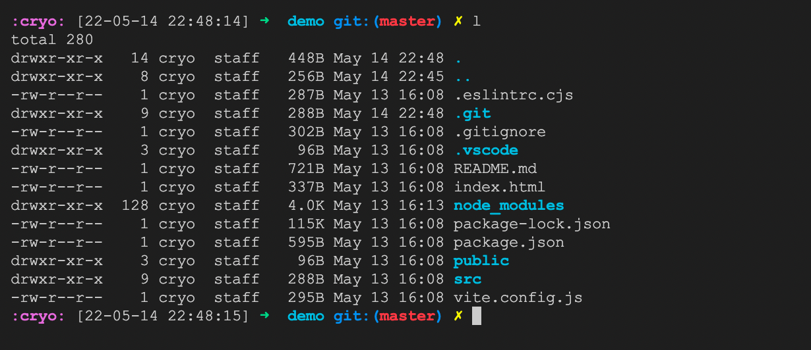

# cryo zsh theme

[ohmyzsh](https://ohmyz.sh/) theme
clone of [robbyrussel](https://github.com/ohmyzsh/ohmyzsh/wiki/Themes#robbyrussell) theme with a date and time stamp.

[](sample.png)

## Install

```bash
# install ohmyzsh
sh -c "$(curl -fsSL https://raw.github.com/ohmyzsh/ohmyzsh/master/tools/install.sh)"

# download theme
curl -fsSL https://raw.githubusercontent.com/cryocaustik/cryo-zsh-theme/master/cryo.zsh-theme > ~/.oh-my-zsh/themes/cryo.zsh-theme

# change theme name in .zshrc
sed -i 's/ZSH_THEME="robbyrussell"/ZSH_THEME="cryo"/' ~/.zshrc

# reload .zshrc
. ~/.zshrc
```
